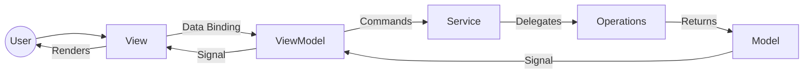
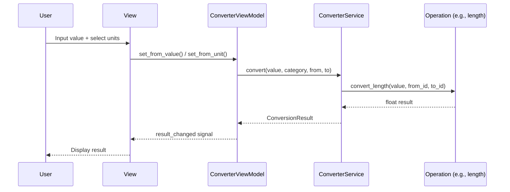

# Unit Converter - General Documentation

## Overview

The Unit Converter project consists of two separate applications sharing identical core logic but with different UI presentations:

| Project | Description | UI Style | Viewport |
|---------|-------------|----------|----------|
| [unitConverter-desktop](./unitConverter-desktop/) | Desktop application | Neumorphism dark mode + sidebar | 1280x800 |
| [unitConverter-mobile](./unitConverter-mobile/) | Mobile application | Glassmorphism dark gradient | 390x844 |

Both applications are built with **Python 3.11+** and **PySide6 (Qt 6)**, managed with **uv** for dependency management.

## Architecture: MVVM + OOP

Both projects follow the **Model-View-ViewModel** pattern with strict separation of concerns:

```
┌─────────────────────────────────────────────────────────┐
│                        View Layer                        │
│  desktop_view.py (Desktop)  │  mobile_view.py (Mobile)  │
│  styles.py                  │  styles.py                 │
├─────────────────────────────────────────────────────────┤
│                    ViewModel Layer                        │
│  converter_viewmodel.py  (Shared)                        │
│  search_viewmodel.py     (Shared)                        │
│  preferences_viewmodel.py (Shared)                       │
├─────────────────────────────────────────────────────────┤
│                    Service Layer                          │
│  converter_service.py    (Shared)                        │
│  search_service.py       (Shared)                        │
│  translations.py         (Shared)                        │
├─────────────────────────────────────────────────────────┤
│                   Operations Layer                        │
│  length_operations.py    (Shared)                        │
│  temperature_operations.py (Shared)                      │
│  area_operations.py      (Shared)                        │
│  volume_operations.py    (Shared)                        │
│  weight_operations.py    (Shared)                        │
│  time_operations.py      (Shared)                        │
├─────────────────────────────────────────────────────────┤
│                    Model Layer                            │
│  unit.py                 (Shared)                        │
│  category.py             (Shared)                        │
│  conversion_result.py    (Shared)                        │
└─────────────────────────────────────────────────────────┘
```

### Layer Responsibilities

| Layer | Role | Qt Dependency |
|-------|------|---------------|
| **Model** | Immutable data classes (Unit, Category, ConversionResult) | None |
| **Operations** | Pure conversion functions, one file per category | None |
| **Service** | Business logic orchestration, search parsing | None |
| **ViewModel** | Reactive state, Qt Signals/Slots binding | QObject |
| **View** | Widget tree, styling, user interaction | QMainWindow |

## Architecture Diagrams

See the detailed Mermaid diagrams in each project's docs:
- [Desktop Architecture](./unitConverter-desktop/docs/architecture.md)
- [Mobile Architecture](./unitConverter-mobile/docs/architecture.md)

### High-Level MVVM Flow



### Conversion Flow



## Conversion Categories

### Length (Base: Meter)
| Unit | Symbol | Factor (to meters) |
|------|--------|--------------------|
| Meter | m | 1 |
| Kilometer | km | 1,000 |
| Centimeter | cm | 0.01 |
| Millimeter | mm | 0.001 |
| Micrometer | μm | 1e-6 |
| Nanometer | nm | 1e-9 |
| Mile | mi | 1,609.344 |
| Yard | yd | 0.9144 |
| Foot | ft | 0.3048 |
| Inch | in | 0.0254 |
| Light Year | ly | 9.461e15 |

### Temperature (Special formulas)
| Conversion | Formula |
|------------|---------|
| °C → °F | °F = °C × 9/5 + 32 |
| °C → K | K = °C + 273.15 |
| °F → °C | °C = (°F - 32) × 5/9 |

### Area (Base: Square Meter)
11 units from Square Micrometer to Square Mile

### Volume (Base: Cubic Meter)
11 units from Cubic Millimeter to US Gallon

### Weight (Base: Kilogram)
10 units from Atomic Mass Unit to Metric Ton

### Time (Base: Second)
11 units from Picosecond to Year

## Internationalization

Supported languages with their codes:

| Code | Language | App Title |
|------|----------|-----------|
| en | English | Unit Converter |
| es | Español | Conversor de Unidades |
| fr | Français | Convertisseur d'Unités |
| it | Italiano | Convertitore di Unità |
| de | Deutsch | Einheitenumrechner |
| ru | Русский | Конвертер Единиц |
| ja | 日本語 | 単位変換 |
| zh | 中文 | 单位转换器 |

## Search Feature

The search bar accepts natural language queries:

| Query Pattern | Example | Action |
|--------------|---------|--------|
| `from X to Y` | "from kilometers to meters" | Navigate to Length, set km→m |
| `X to Y` | "celsius to fahrenheit" | Navigate to Temperature, set °C→°F |
| `unit name` | "kilogram" | Navigate to Weight category |
| `category` | "length" | Navigate to Length category |
| `partial` | "kilo" | Show matching units |

Search is **case-insensitive** and matches against unit IDs, names, symbols, and aliases.

## Testing

Both projects use **pytest** with the following test structure:

| Type | Location | Purpose |
|------|----------|---------|
| Unit | `tests/unit/` | Individual class/function tests |
| Integration | `tests/integration/` | Cross-layer workflow tests |
| E2E | `tests/e2e/` | Full application scenario tests |

### Running Tests

```bash
# Desktop
cd unitConverter-desktop
uv run pytest tests/ -v

# Mobile
cd unitConverter-mobile
uv run pytest tests/ -v
```

### Test Coverage

- **Desktop**: 220 tests, 100% pass rate
- **Mobile**: 218 tests, 100% pass rate

## Building Binary Executables

### Prerequisites
```bash
uv sync --dev  # Includes PyInstaller
```

### Desktop Build
```bash
cd unitConverter-desktop
uv run pyinstaller --onefile --windowed \
    --name "UnitConverter-Desktop" \
    --add-data "src:src" \
    main.py
```

### Mobile Build
```bash
cd unitConverter-mobile
uv run pyinstaller --onefile --windowed \
    --name "UnitConverter-Mobile" \
    --add-data "src:src" \
    main.py
```

### Platform-Specific Notes

| Platform | Output Format | Notes |
|----------|---------------|-------|
| Linux | ELF binary | Requires Qt6 runtime libraries |
| macOS | `.app` bundle | Use `--windowed` to suppress terminal |
| Windows | `.exe` | Use `--windowed` to suppress console |

### Recommended PyInstaller Flags

```bash
--onefile          # Single executable
--windowed         # No console window (macOS/Windows)
--name "AppName"   # Output filename
--add-data "src:src"  # Include source package
--icon icon.ico    # Application icon (optional)
```

## Dependency Management

Both projects use **uv** for fast, reliable dependency management:

```bash
# Install runtime + dev dependencies
uv sync --dev

# Add a new dependency
uv add <package>

# Add a dev dependency
uv add --dev <package>
```

### Runtime Dependencies
- `PySide6 >= 6.6.0` - Qt 6 Python bindings

### Dev Dependencies
- `pytest >= 8.0.0` - Test framework
- `pytest-cov >= 4.0.0` - Coverage reporting
- `pytest-qt >= 4.3.0` - Qt test utilities
- `selenium >= 4.15.0` - E2E testing support
- `pyinstaller >= 6.0.0` - Binary builds

## Design Reference

Both UIs are based on the reference design in `index.html`:
- **Desktop**: Neumorphism dark mode with sidebar navigation (1440x900 reference)
- **Mobile**: Glassmorphism dark gradient with bottom navigation (390x844 reference)

### Color Palette

| Name | Hex | Usage |
|------|-----|-------|
| Navy Dark | #0F0C29 | Background start |
| Purple Mid | #302B63 | Background middle |
| Purple Light | #24243e | Background end |
| Accent Violet | #7F5AF0 | Primary accent |
| Accent Blue | #6C63FF | Secondary accent |
| Sidebar BG | #16161F | Desktop sidebar |
| Card BG | #1E1E2E | Card backgrounds |
| Text White | #FFFFFF | Primary text |
