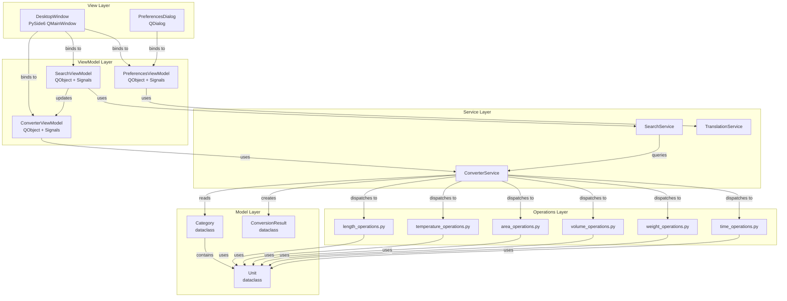
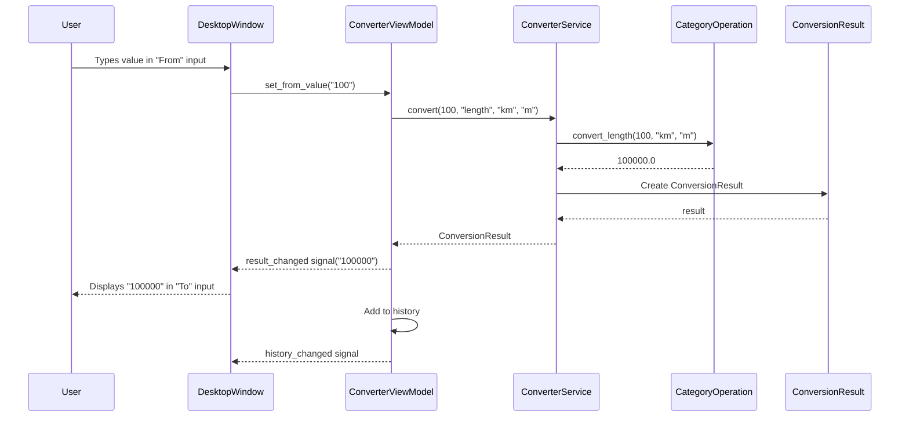
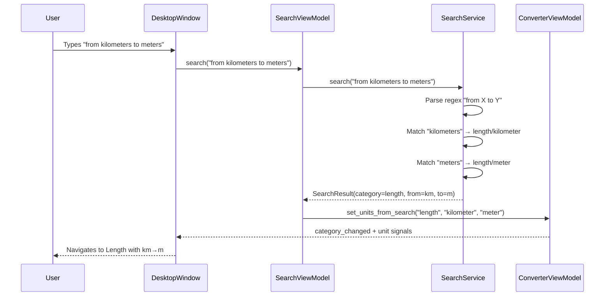
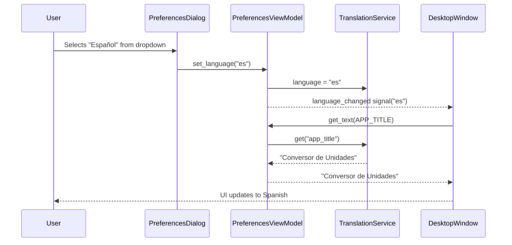

# Architecture Documentation

## MVVM Architecture Diagram



## Conversion Sequence Diagram



## Search Sequence Diagram



## Language Change Sequence Diagram



## Building Binary Files

### Desktop Application (PyInstaller)

```bash
# Install dependencies
uv sync --dev

# Build single-file executable
uv run pyinstaller --onefile --windowed \
    --name "UnitConverter-Desktop" \
    --add-data "src:src" \
    main.py

# Output: dist/UnitConverter-Desktop
```

### Cross-Platform Build Matrix

| Platform | Command | Output |
|----------|---------|--------|
| Linux | `uv run pyinstaller --onefile main.py` | `dist/UnitConverter-Desktop` |
| macOS | `uv run pyinstaller --onefile --windowed main.py` | `dist/UnitConverter-Desktop.app` |
| Windows | `uv run pyinstaller --onefile --windowed main.py` | `dist/UnitConverter-Desktop.exe` |

### Build Notes

1. PyInstaller bundles Python + PySide6 + all dependencies into a single executable
2. Use `--windowed` flag on macOS/Windows to suppress the console window
3. The `--add-data` flag ensures the `src` package is included in the bundle
4. For smaller builds, use `--exclude-module` to remove unused Qt modules
5. Test the built binary on a clean machine without Python installed
