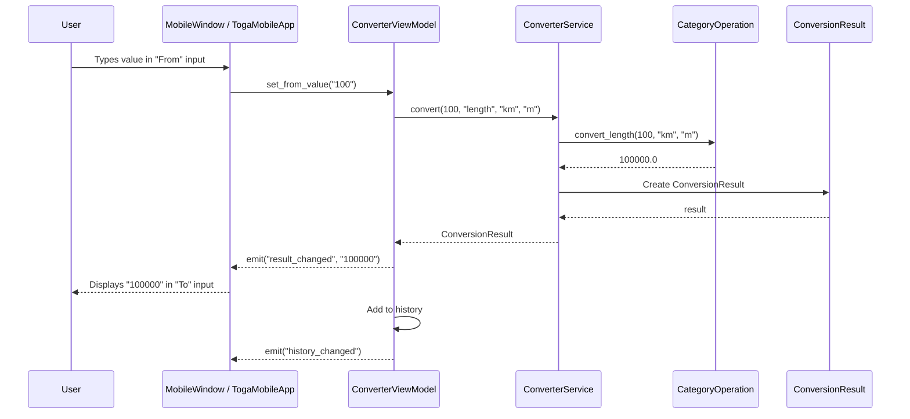
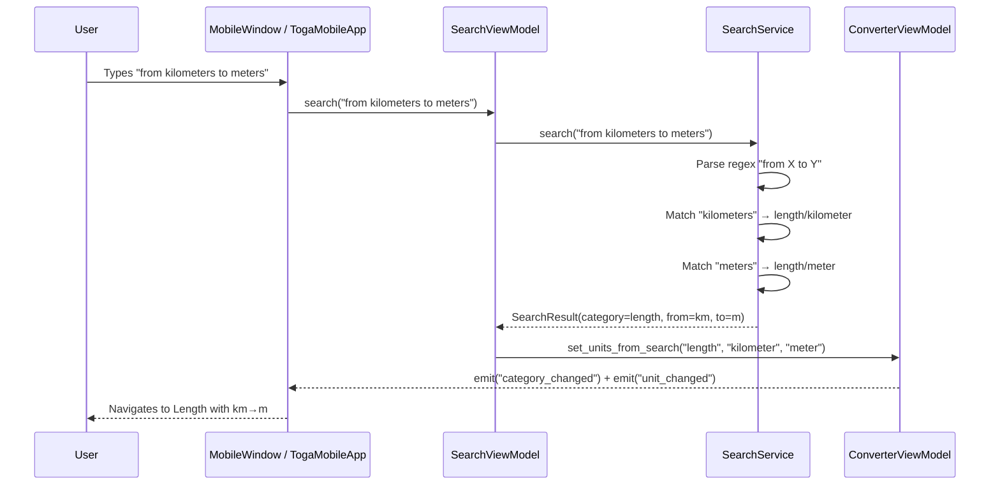
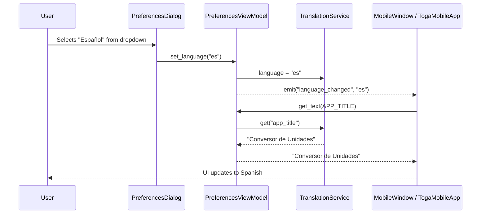
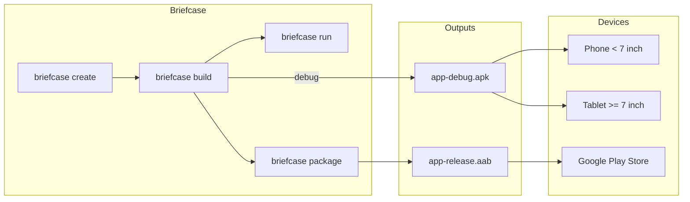
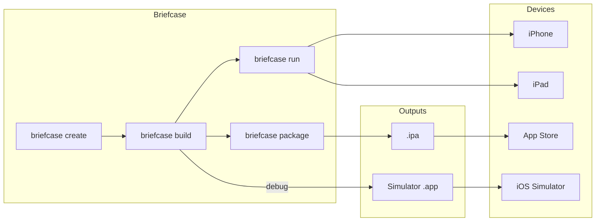

# Architecture Documentation

## MVVM Architecture Diagram

```mermaid
graph TB
    subgraph View Layer
        DV[MobileWindow<br/>PySide6 QMainWindow<br/>desktop]
        TV[TogaMobileApp<br/>Toga App<br/>Android / iOS]
        PD[PreferencesDialog<br/>QDialog — desktop only]
    end

    subgraph ViewModel Layer
        CVM[ConverterViewModel<br/>EventMixin]
        SVM[SearchViewModel<br/>EventMixin]
        PVM[PreferencesViewModel<br/>EventMixin]
    end

    subgraph Service Layer
        CS[ConverterService]
        SS[SearchService]
        TS[TranslationService]
    end

    subgraph Model Layer
        U[Unit<br/>dataclass]
        C[Category<br/>dataclass]
        CR[ConversionResult<br/>dataclass]
    end

    subgraph Operations Layer
        LO[length_operations.py]
        TO[temperature_operations.py]
        AO[area_operations.py]
        VO[volume_operations.py]
        WO[weight_operations.py]
        TiO[time_operations.py]
    end

    DV -->|.on\(\) binds to| CVM
    DV -->|.on\(\) binds to| SVM
    DV -->|.on\(\) binds to| PVM
    TV -->|.on\(\) binds to| CVM
    TV -->|.on\(\) binds to| SVM
    TV -->|.on\(\) binds to| PVM
    PD -->|.on\(\) binds to| PVM

    CVM -->|uses| CS
    SVM -->|uses| SS
    SVM -->|updates| CVM
    PVM -->|uses| TS

    CS -->|creates| CR
    CS -->|dispatches to| LO
    CS -->|dispatches to| TO
    CS -->|dispatches to| AO
    CS -->|dispatches to| VO
    CS -->|dispatches to| WO
    CS -->|dispatches to| TiO

    SS -->|queries| CS
    CS -->|reads| C
    C -->|contains| U

    LO -->|uses| U
    TO -->|uses| U
    AO -->|uses| U
    VO -->|uses| U
    WO -->|uses| U
    TiO -->|uses| U
```

## Platform Detection Flow

`main.py` determines the UI backend at startup:

```mermaid
flowchart TD
    Start[main.py] --> Check{import android<br/>or rubicon.objc?}
    Check -->|yes| Toga[_run_mobile\(\)<br/>TogaMobileApp — Toga UI]
    Check -->|no| PySide[_run_desktop\(\)<br/>MobileWindow — PySide6 UI]
    Toga --> VM[Shared ViewModels<br/>EventMixin]
    PySide --> VM
```

## EventMixin Pattern

All three ViewModels inherit from `EventMixin` (`viewmodels/event_mixin.py`) instead of PySide6's `QObject`. This removes the runtime dependency on PySide6 from the ViewModel layer, allowing the same ViewModels to drive both the PySide6 desktop view and the Toga mobile view.

| PySide6 (old) | EventMixin (new) | Purpose |
|---------------|------------------|---------|
| `class VM(QObject)` | `class VM(EventMixin)` | Base class |
| `Signal(str)` | *(none — events are string-named)* | Declare event |
| `self.my_signal.emit(val)` | `self.emit("my_signal", val)` | Fire event |
| `vm.my_signal.connect(fn)` | `vm.on("my_signal", fn)` | Listen |
| `vm.my_signal.disconnect(fn)` | `vm.off("my_signal", fn)` | Unlisten |

The `EventMixin` is ~30 lines of pure Python with no external dependencies. Views register callbacks with `.on()` and ViewModels fire them with `.emit()`.

## Conversion Sequence Diagram



## Search Sequence Diagram



## Language Change Sequence Diagram



## Building Binary Files

### Desktop Binary (PyInstaller)

```bash
# Install dependencies
uv sync --dev

# Build single-file executable
uv run pyinstaller --onefile --windowed \
    --name "UnitConverter-Mobile" \
    --add-data "unitconverter:unitconverter" \
    main.py

# Output: dist/UnitConverter-Mobile
```

### Desktop Cross-Platform Build Matrix

| Platform | Command | Output |
|----------|---------|--------|
| Linux | `uv run pyinstaller --onefile main.py` | `dist/UnitConverter-Mobile` |
| macOS | `uv run pyinstaller --onefile --windowed main.py` | `dist/UnitConverter-Mobile.app` |
| Windows | `uv run pyinstaller --onefile --windowed main.py` | `dist/UnitConverter-Mobile.exe` |

### Android APK Build (Briefcase)

The Android build produces a universal APK/AAB that supports both **phone** and **tablet** form factors. The `DeviceProfile` class in `main.py` detects the device at runtime.

```bash
# Prerequisites: Java JDK 17+, Android SDK (API 34)
uv sync --dev

# Create Android project
uv run briefcase create android

# Build debug APK
uv run briefcase build android

# Run on device/emulator
uv run briefcase run android

# Package signed AAB for Google Play Store
uv run briefcase package android
```

#### Android Build Flow



#### Android Build Matrix

| Build Type | Command | Output | Distribution |
|------------|---------|--------|-------------|
| Debug APK | `briefcase build android` | `app-debug.apk` | Sideload / testing |
| AAB Bundle | `briefcase package android` | `app-release.aab` | Google Play Store |

#### Android Configuration Summary

| Setting | Value |
|---------|-------|
| Target SDK | 34 (Android 14) |
| Minimum SDK | 26 (Android 8.0 Oreo) |
| Build Tools | 34.0.0 |
| Device Families | Phone (1) + Tablet (2) |
| Orientation | fullUser (auto-rotate) |
| Permissions | None required |

### iOS Build (Briefcase)

The iOS build produces a universal app for both **iPhone** and **iPad**. Requires macOS with Xcode.

```bash
# Prerequisites: macOS, Xcode 15+, Apple Developer account
uv sync --dev

# Create iOS project (Xcode project)
uv run briefcase create iOS

# Build debug build
uv run briefcase build iOS

# Run on iOS Simulator
uv run briefcase run iOS

# Run on physical device
uv run briefcase run iOS -d <device-udid>

# Package signed IPA for App Store
uv run briefcase package iOS
```

#### iOS Build Flow



#### iOS Build Matrix

| Build Type | Command | Output | Distribution |
|------------|---------|--------|-------------|
| Debug | `briefcase build iOS` | Simulator `.app` | Testing on Simulator |
| IPA | `briefcase package iOS` | `.ipa` | App Store / TestFlight |

#### iOS Configuration Summary

| Setting | Value |
|---------|-------|
| Deployment Target | iOS 15.0 |
| Device Families | iPhone (1) + iPad (2) |
| Orientations | Portrait + Landscape |
| Multitasking | Supported (iPad) |

### Build Notes

1. **Desktop**: PyInstaller bundles Python + PySide6 + all dependencies into a single executable
2. Use `--windowed` flag on macOS/Windows to suppress the console window
3. The `--add-data` flag ensures the `unitconverter` package is included in the bundle
4. For smaller builds, use `--exclude-module` to remove unused Qt modules
5. Test the built binary on a clean machine without Python installed
6. **Android/iOS**: Briefcase injects Toga as the UI backend — PySide6 is **not** included in mobile builds
7. Android builds require JDK 17+ and Android SDK; Briefcase will auto-download the SDK if not present
8. iOS builds require macOS with Xcode; signing requires an Apple Developer account
9. Both Android and iOS builds produce a single universal binary that adapts to phone/tablet at runtime via `DeviceProfile`
10. ViewModels use `EventMixin` (pure Python) so they work with both PySide6 and Toga without modification
